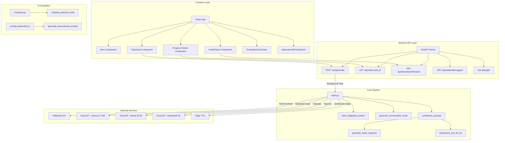
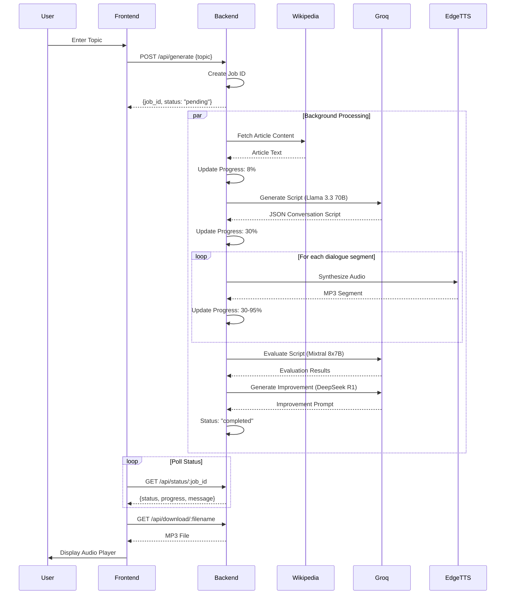

# 🏗️ System Architecture

> Comprehensive technical documentation for the Synthetic Radio Host project

## 📋 Table of Contents

1. [System Overview](#system-overview)
2. [Architecture Diagrams](#architecture-diagrams)
3. [Component Breakdown](#component-breakdown)
4. [Data Flow](#data-flow)
5. [Technology Stack](#technology-stack)
6. [Pipeline Details](#pipeline-details)

---

## 🎯 System Overview

**Synthetic Radio Host** is an AI-powered podcast generation system that converts Wikipedia articles into natural-sounding Hinglish (Hindi-English) audio podcasts. The system features two Gen-Z hosts (RJ Priya and RJ Amit) who engage in conversational, energetic dialogues.

### Three-Tier Architecture

```
┌─────────────────────────────────────────────────────────────┐
│                    PRESENTATION LAYER                        │
│              React Frontend (Vite + React)                    │
│  ┌──────────┐ ┌──────────┐ ┌──────────┐ ┌──────────┐        │
│  │   Hero   │ │  Topic   │ │ Progress │ │  Audio   │        │
│  │          │ │  Input   │ │ Tracker  │ │  Player  │        │
│  └──────────┘ └──────────┘ └──────────┘ └──────────┘        │
└─────────────────────────────────────────────────────────────┘
                            ↕ HTTP/REST API
┌─────────────────────────────────────────────────────────────┐
│                    APPLICATION LAYER                        │
│              FastAPI Backend (Python)                         │
│  ┌──────────────────────────────────────────────────────┐    │
│  │  API Endpoints: /api/generate, /api/status,          │    │
│  │                 /api/download, /api/wikipedia         │    │
│  │  Job Management: In-memory job tracking             │    │
│  └──────────────────────────────────────────────────────┘    │
└─────────────────────────────────────────────────────────────┘
                            ↕
┌─────────────────────────────────────────────────────────────┐
│                    BUSINESS LOGIC LAYER                      │
│              Core Pipeline (main.py)                         │
│  ┌──────────┐ ┌──────────┐ ┌──────────┐ ┌──────────┐      │
│  │Wikipedia │ │   LLM    │ │   TTS    │ │  Audio   │      │
│  │  Fetcher │ │  Script   │ │ Synthesis│ │Concatenate│     │
│  └──────────┘ └──────────┘ └──────────┘ └──────────┘      │
└─────────────────────────────────────────────────────────────┘
                            ↕
┌─────────────────────────────────────────────────────────────┐
│                    EXTERNAL SERVICES                         │
│  ┌──────────┐ ┌──────────┐ ┌──────────┐                    │
│  │Wikipedia │ │   Groq   │ │ Edge TTS │                    │
│  │   API    │ │   API    │ │  Service │                    │
│  └──────────┘ └──────────┘ └──────────┘                    │
└─────────────────────────────────────────────────────────────┘
```

---

## 📊 Architecture Diagrams

### System Component Flow



### Complete Data Flow



---

## 🔧 Component Breakdown

### Frontend Components

#### 1. **App.jsx** - Main Application Controller
- **Responsibility**: Central state management and orchestration
- **State Variables**:
  - `status`: Application state (idle, processing, completed, failed)
  - `jobId`: Unique job identifier
  - `progress`: Progress percentage (0-100)
  - `message`: Backend status message
  - `audioUrl`: Generated MP3 URL
  - `evaluation`: Quality evaluation results
  - `improvementPrompt`: AI-generated improvement suggestions
- **Key Features**:
  - Polling mechanism (1-second intervals)
  - Error handling and recovery
  - State machine implementation

#### 2. **TopicInput.jsx** - Wikipedia Topic Input
- **Features**:
  - Real-time autocomplete (Wikipedia OpenSearch API)
  - Debounced search (300ms delay)
  - Keyboard navigation (↑↓ arrows, Enter, Escape)
  - Loading indicator
  - Form validation

#### 3. **ProgressTracker.jsx** - Progress Display
- **Features**:
  - Animated progress bar
  - Dynamic status messages
  - Fun facts during processing
  - Smooth progress transitions
  - Backend progress synchronization

#### 4. **AudioPlayer.jsx** - Audio Playback
- **Features**:
  - Play/Pause controls
  - Speed control (1x - 4x)
  - Progress slider with time display
  - Download functionality
  - Waveform animation
  - Speaker indicators (👨 Amit, 👩‍🦰 Priya)

#### 5. **EvaluationScoreCard.jsx** - Quality Metrics
- **Features**:
  - Overall score display (color-coded)
  - 5-category breakdown
  - Strengths and weaknesses
  - Specific suggestions
  - Expandable categories

#### 6. **ImprovementPromptCard.jsx** - AI Suggestions
- **Features**:
  - Copy-to-clipboard functionality
  - Focus area highlights
  - AI-IDE ready format
  - Success toast notifications

### Backend Components

#### 1. **server.py** - FastAPI Server

**Endpoints**:

| Endpoint | Method | Description |
|----------|--------|-------------|
| `/api/generate` | POST | Start podcast generation |
| `/api/status/:job_id` | GET | Get job status and progress |
| `/api/download/:filename` | GET | Download generated MP3 |
| `/api/wikipedia/suggest` | GET | Get Wikipedia topic suggestions |

**Features**:
- CORS middleware for frontend access
- Background task processing
- In-memory job tracking
- Progress callback system
- Static file serving

#### 2. **main.py** - Core Pipeline Logic

**Key Functions**:

##### `fetch_wikipedia_content(topic, lang='en')`
- Fetches Wikipedia article using MediaWiki API
- Handles errors (topic not found, disambiguation)
- Returns formatted content string

##### `generate_conversation_script(topic_content, api_key)`
- **LLM**: Llama 3.3 70B Versatile
- **Output**: JSON with 15-20 dialogue segments
- **Features**:
  - Gen-Z Hinglish style
  - Emotional tone markers ([laughs], [playful])
  - Filler word guidelines (30-40% usage, max 1 per sentence)
  - Reactive dialogue patterns

##### `preprocess_text_for_tts(text)`
- Pronunciation fixes (tune → तूने)
- Phonetic adjustments for proper names
- Minimal post-processing (filler control via LLM)

##### `generate_audio_segment(text, voice, filename, rate, pitch)`
- **Voice Models**:
  - Priya: `hi-IN-SwaraNeural` (Female, +4Hz pitch, +20-25% rate)
  - Amit: `hi-IN-MadhurNeural` (Male, -2Hz pitch, +15-20% rate)
- Edge TTS synthesis with prosody control

##### `synthesize_podcast(script, output_file, progress_callback)`
- Iterates through script segments
- Assigns appropriate voices
- Concatenates audio segments
- Updates progress (30-95%)

##### `run_podcast_generation(topic, progress_callback)`
- **Pipeline Stages**:
  1. Fetch Wikipedia (0-8%)
  2. Generate script (8-30%)
  3. Synthesize audio (30-95%)
  4. Evaluate quality (95-98%)
  5. Generate improvements (98-100%)

#### 3. **evaluator.py** - AI Quality Evaluator

**LLM**: Mixtral 8x7B Instruct

**Evaluation Categories** (Weighted):

1. **Hinglish Quality** (25%)
   - Code-mixing naturalness
   - Roman Hindi/English balance
   - Authentic expressions

2. **Conversational Naturalness** (30%)
   - Dialogue flow and transitions
   - Interruptions and reactions
   - Spontaneous speech patterns

3. **Emotional Expression** (20%)
   - Mood variety
   - Tone appropriateness
   - Emotional authenticity

4. **Content Coherence** (15%)
   - Topic progression
   - Information accuracy
   - Logical flow

5. **Host Chemistry** (10%)
   - Interaction dynamics
   - Personality distinction
   - Engagement level

**Scoring**:
- Scale: 1-5 (5 being excellent)
- Overall: Weighted average
- Labels: Excellent (4.5+), Great (4.0-4.5), Good (3.5-4.0), Needs Work (3.0-3.5), Poor (<3.0)

#### 4. **prompt_generator.py** - Improvement Suggestions

**LLM**: DeepSeek R1 Distill Llama 70B

**Features**:
- Analyzes low-scoring categories (<4.0)
- Generates actionable code changes
- Maintains existing strengths
- AI-IDE ready format
- Generic and reusable prompts

---

## 🔄 Data Flow

### Job Object Structure

```python
{
    "status": "pending" | "processing" | "completed" | "failed",
    "topic": "string",
    "message": "string",
    "filename": "string | None",
    "progress": 0-100,
    "evaluation": {
        "overall_score": 4.2,
        "categories": {...},
        "strengths": [...],
        "areas_for_improvement": [...]
    },
    "improvement_prompt": {
        "prompt": "string",
        "metadata": {...}
    }
}
```

### Script Format (LLM Output)

```json
{
    "conversation": [
        {
            "speaker": "Priya",
            "text": "Arre yaar, aaj hum baat karte hain space ke baare mein! [excited]"
        },
        {
            "speaker": "Amit",
            "text": "Haan bhai, space toh literally infinite hai na? [playful]"
        }
    ]
}
```

---

## 🛠️ Technology Stack

### Frontend
- **Framework**: React 18.3.1
- **Build Tool**: Vite 5.4.1
- **Styling**: CSS with CSS Variables (glassmorphism)
- **HTTP Client**: Fetch API (native)

### Backend
- **Framework**: FastAPI
- **Server**: Uvicorn (ASGI)
- **Language**: Python 3.8+
- **Async**: asyncio for concurrent operations

### External Services
- **LLM (Generation)**: Groq API - Llama 3.3 70B Versatile
- **LLM (Evaluation)**: Groq API - Mixtral 8x7B Instruct
- **LLM (Improvement)**: Groq API - DeepSeek R1 Distill Llama 70B
- **TTS**: Microsoft Edge TTS
- **Content**: Wikipedia MediaWiki API
- **Audio Format**: MP3

### Key Libraries

**Backend**:
- `groq` - Groq API client
- `edge-tts` - Microsoft Edge TTS library
- `requests` - HTTP requests
- `httpx` - Async HTTP client
- `python-dotenv` - Environment variables
- `pydub` - Audio processing

**Frontend**:
- `react` - UI framework
- `react-dom` - React rendering

---

## 🔍 Pipeline Details

### Text Processing Pipeline

```
Raw Text → Pronunciation Fixes → TTS Synthesis → MP3 Segment
            ↓
         तूने conversion
         Phonetic adjustments
         (Fillers controlled by LLM)
```

### Audio Synthesis Pipeline

```
Script → For each segment:
          ├─ Determine Speaker (Priya/Amit)
          ├─ Preprocess Text
          ├─ Apply Voice Settings (rate, pitch)
          ├─ Generate Audio (Edge TTS)
          └─ Append to Final MP3
       → Complete Audio File
```

### Three-LLM Architecture

The project uses **three different LLMs** for distinct purposes:

1. **Llama 3.3 70B** - Primary script generation
   - Fast inference
   - High-quality Hinglish generation
   - Instruction following

2. **Mixtral 8x7B** - Quality evaluation (critic)
   - Unbiased assessment
   - Detailed feedback
   - Category-wise scoring

3. **DeepSeek R1 Distill Llama 70B** - Improvement suggestions
   - Meta-level reasoning
   - Code-focused recommendations
   - Generic prompt generation

---

## 🚀 Deployment Considerations

### Production Architecture

```
User → Nginx/Reverse Proxy → React Frontend (Port 5173)
                           → FastAPI Backend (Port 8000)
                           → Output Directory (MP3 files)
```

### Scalability

**Current Limitations**:
- In-memory job storage (not persistent)
- No job queue management
- Sequential podcast generation

**Recommended Improvements**:
- Redis for job storage
- Celery for task queue
- Multiple worker processes
- Cloud storage for MP3 files (S3, GCS)
- CDN for static assets

### Performance Metrics

- **Wikipedia Fetch**: ~1-2 seconds
- **Script Generation**: ~5-10 seconds (LLM inference)
- **Audio Synthesis**: ~20-40 seconds (15-20 segments)
- **Evaluation**: ~3-5 seconds
- **Total**: ~30-60 seconds per podcast

---

## 📝 Configuration

### Environment Variables

```bash
GROQ_API_KEY=your_groq_api_key_here
```

### Voice Configuration

```python
PRIYA_VOICE = "hi-IN-SwaraNeural"
PRIYA_RATE = "+20%"  # to +25%
PRIYA_PITCH = "+4Hz"

AMIT_VOICE = "hi-IN-MadhurNeural"
AMIT_RATE = "+15%"  # to +20%
AMIT_PITCH = "-2Hz"
```

### Output Settings

- **Max Duration**: 2 minutes
- **Segments**: 15-20 dialogues
- **Word Count**: ~280 words
- **Format**: MP3
- **Sample Rate**: Default Edge TTS (24kHz)

---

## 🔒 Security Considerations

### Current Implementation
- CORS enabled for all origins (development)
- No authentication/authorization
- API keys in environment variables
- No rate limiting

### Production Recommendations
- Restrict CORS to specific domains
- Implement API key authentication
- Add rate limiting (per IP/user)
- Input validation and sanitization
- Secure file storage and access
- HTTPS only

---

**For more information, see**: [README.md](README.md) | [Contributing Guide](CONTRIBUTING.md)
