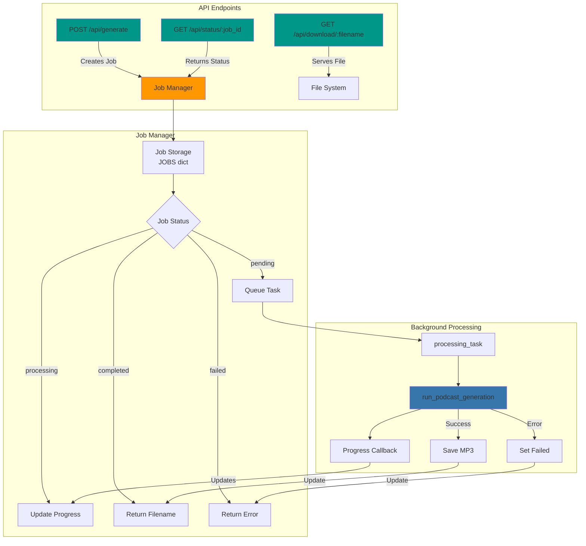

# Synthetic Radio Host - Complete Project Documentation

## 📋 Table of Contents
1. [Project Overview](#project-overview)
2. [High-Level System Design](#high-level-system-design)
3. [Architecture Diagrams](#architecture-diagrams)
4. [Component Breakdown](#component-breakdown)
5. [Data Flow](#data-flow)
6. [Technology Stack](#technology-stack)
7. [Key Features](#key-features)

---

## 🎯 Project Overview

**Synthetic Radio Host** (also branded as "Rangeelo Radio 📻") is an AI-powered podcast generation system that converts Wikipedia articles into natural-sounding Hinglish (Hindi-English) audio podcasts. The system features two Gen-Z hosts (Priya and Amit) who engage in conversational, energetic dialogues about any topic.

### Core Functionality
- **Input**: User provides a Wikipedia topic (e.g., "Space", "Bollywood", "AI")
- **Processing**: System fetches Wikipedia content, generates conversational script, and synthesizes audio
- **Output**: A 1-2 minute MP3 podcast file featuring two voices in Hinglish

---

## 🏗️ High-Level System Design

The system follows a **3-tier architecture**:

```
┌─────────────────────────────────────────────────────────────┐
│                    PRESENTATION LAYER                        │
│              React Frontend (Vite + React)                    │
│  ┌──────────┐ ┌──────────┐ ┌──────────┐ ┌──────────┐        │
│  │   Hero   │ │  Topic   │ │ Progress │ │  Audio   │        │
│  │          │ │  Input   │ │ Tracker  │ │  Player  │        │
│  └──────────┘ └──────────┘ └──────────┘ └──────────┘        │
└─────────────────────────────────────────────────────────────┘
                            ↕ HTTP/REST API
┌─────────────────────────────────────────────────────────────┐
│                    APPLICATION LAYER                        │
│              FastAPI Backend (Python)                         │
│  ┌──────────────────────────────────────────────────────┐    │
│  │  API Endpoints: /api/generate, /api/status,          │    │
│  │                 /api/download                        │    │
│  │  Job Management: In-memory job tracking             │    │
│  └──────────────────────────────────────────────────────┘    │
└─────────────────────────────────────────────────────────────┘
                            ↕
┌─────────────────────────────────────────────────────────────┐
│                    BUSINESS LOGIC LAYER                      │
│              Core Pipeline (main.py)                         │
│  ┌──────────┐ ┌──────────┐ ┌──────────┐ ┌──────────┐      │
│  │Wikipedia │ │   LLM    │ │   TTS    │ │  Audio   │      │
│  │  Fetcher │ │  Script   │ │ Synthesis│ │ Concatenate│    │
│  └──────────┘ └──────────┘ └──────────┘ └──────────┘      │
└─────────────────────────────────────────────────────────────┘
                            ↕
┌─────────────────────────────────────────────────────────────┐
│                    EXTERNAL SERVICES                         │
│  ┌──────────┐ ┌──────────┐ ┌──────────┐                    │
│  │Wikipedia │ │   Groq   │ │ Edge TTS │                    │
│  │   API    │ │   API    │ │  Service │                    │
│  └──────────┘ └──────────┘ └──────────┘                    │
└─────────────────────────────────────────────────────────────┘
```

---

## 📊 Architecture Diagrams

### 1. System Architecture Overview

```mermaid
graph TB
    subgraph "Frontend Layer"
        A[React App] --> B[Hero Component]
        A --> C[TopicInput Component]
        A --> D[ProgressTracker Component]
        A --> E[AudioPlayer Component]
    end
    
    subgraph "Backend API Layer"
        F[FastAPI Server] --> G[/api/generate]
        F --> H[/api/status/:job_id]
        F --> I[/api/download/:filename]
        F --> J[Job Manager<br/>In-Memory Storage]
    end
    
    subgraph "Core Pipeline"
        K[main.py] --> L[fetch_wikipedia_content]
        K --> M[generate_conversation_script]
        K --> N[synthesize_podcast]
        N --> O[generate_audio_segment]
        N --> P[preprocess_text_for_tts]
    end
    
    subgraph "External Services"
        Q[Wikipedia API]
        R[Groq API<br/>Llama 3.3 70B]
        S[Edge TTS<br/>Microsoft]
    end
    
    C -->|POST /api/generate| G
    D -->|GET /api/status| H
    E -->|GET /api/download| I
    G -->|Background Task| K
    K -->|Fetch Content| Q
    K -->|Generate Script| R
    K -->|Synthesize Audio| S
    K -->|Save MP3| T[(Output Directory)]
    I -->|Serve File| T
    
    style A fill:#61dafb
    style F fill:#009688
    style K fill:#3776ab
    style Q fill:#ff6b6b
    style R fill:#ff6b6b
    style S fill:#ff6b6b
```

### 2. Complete Data Flow

```mermaid
sequenceDiagram
    participant User
    participant Frontend
    participant Backend
    participant Wikipedia
    participant Groq
    participant EdgeTTS
    participant FileSystem

    User->>Frontend: Enter Topic
    Frontend->>Backend: POST /api/generate {topic}
    Backend->>Backend: Create Job ID
    Backend-->>Frontend: Return {job_id, status: "pending"}
    
    Note over Backend: Background Task Starts
    
    Backend->>Wikipedia: GET /w/api.php?action=query
    Wikipedia-->>Backend: Return Wikipedia Content
    
    Backend->>Backend: Progress: 2% → 8%
    
    Backend->>Groq: POST /chat/completions<br/>(Llama 3.3 70B)
    Note over Groq: Generate Hinglish Script<br/>(15-20 dialogue segments)
    Groq-->>Backend: JSON Script {conversation: [...]}
    
    Backend->>Backend: Progress: 15% → 30%
    
    loop For each dialogue segment
        Backend->>Backend: Preprocess text<br/>(Add fillers, fix pronunciation)
        Backend->>EdgeTTS: Generate audio segment<br/>(Voice: Priya/Amit)
        EdgeTTS-->>Backend: MP3 segment
        Backend->>FileSystem: Append segment to final MP3
        Backend->>Backend: Update Progress: 30% → 100%
    end
    
    Backend->>FileSystem: Save final MP3
    Backend->>Backend: Job Status: "completed"
    
    loop Polling every 1 second
        Frontend->>Backend: GET /api/status/:job_id
        Backend-->>Frontend: {status, progress, message}
    end
    
    Frontend->>Backend: GET /api/download/:filename
    Backend-->>Frontend: MP3 File
    Frontend->>User: Display Audio Player
```



### 3. Component Interaction Flow


### 4. Frontend Component Hierarchy


### 5. Backend API Flow



### 6. Core Pipeline Detailed Flow


### 7. Text Processing Pipeline

```mermaid
graph LR
    A[Raw Dialogue Text] --> B[preprocess_text_for_tts]
    
    B --> C{Text Processing}
    C --> D[Fix 'tune' → 'तूने'<br/>Devanagari conversion]
    C --> E[Phonetic Tweaks<br/>Rajasthan → Raajas-thaan]
    C --> F[Random Filler Injection<br/>40% probability]
    
    F --> G{Filler Selection}
    G --> H[Common: Yaar, Bhai, Bro]
    G --> I[Attention: Sunn, Dekho, Arre]
    G --> J[Agreement: Haina, Na, Accha]
    G --> K[English: You know, I mean, Well]
    G --> L[Emphasis: Wahi toh, Seriously, Legit]
    
    H --> M[Final Processed Text]
    I --> M
    J --> M
    K --> M
    L --> M
    D --> M
    E --> M
    
    M --> N[Edge TTS Synthesis]
    N --> O[MP3 Audio Segment]
    
    style B fill:#ff9800
    style M fill:#4caf50
    style N fill:#2196f3
```



---

## 🔧 Component Breakdown

### Frontend Components

#### 1. **App.jsx** - Main Application Controller
- **Purpose**: Central state management and orchestration
- **Key Responsibilities**:
  - Manages application state (idle, processing, completed, failed)
  - Handles API communication
  - Implements polling mechanism for job status
  - Error handling and recovery
- **State Variables**:
  - `status`: Current application state
  - `jobId`: Unique identifier for generation job
  - `progress`: Progress percentage (0-100)
  - `message`: Status message from backend
  - `audioUrl`: URL to generated MP3 file
  - `error`: Error message if generation fails

#### 2. **Hero.jsx** - Header Component
- **Purpose**: Displays application title and description
- **Content**: "Rangeelo Radio 📻" branding with Rajasthani theme

#### 3. **TopicInput.jsx** - Topic Submission Form
- **Purpose**: User input for Wikipedia topic
- **Features**:
  - Text input field
  - Form validation
  - Submit button with loading state
  - Rajasthani-themed placeholder text

#### 4. **ProgressTracker.jsx** - Progress Display
- **Purpose**: Shows real-time generation progress
- **Features**:
  - Animated progress bar
  - Dynamic status messages
  - Fun facts about Rajasthan (entertainment during wait)
  - Simulated progress animation (smooth UX)
  - Backend progress synchronization

#### 5. **AudioPlayer.jsx** - Audio Playback Component
- **Purpose**: Playback controls for generated podcast
- **Features**:
  - Play/Pause controls
  - Progress slider with hover preview
  - Speed control (1x, 1.5x, 2x, 3x, 4x)
  - Time display (current/total)
  - Download button
  - Visual waveform animation
  - Speaker emoji indicators (👨 Amit, 👩‍🦰 Priya)

#### 6. **EvaluationScoreCard.jsx** - Quality Evaluation Display ⭐ NEW
- **Purpose**: Shows AI evaluation results and feedback
- **Features**:
  - Overall score display with color-coded rating
  - Category-wise breakdown (5 categories)
  - Individual category scores (1-5 scale)
  - Strengths highlighted
  - Areas for improvement listed
  - Specific suggestions provided
  - Visual score indicators (stars/ratings)
  - Expandable/collapsible categories

#### 7. **ImprovementPromptCard.jsx** - Improvement Suggestions ⭐ NEW
- **Purpose**: Displays AI-generated improvement prompts
- **Features**:
  - Generated improvement prompt display
  - Copy-to-clipboard functionality
  - Focus areas highlighted
  - Target score indicators
  - AI-IDE ready format
  - One-click copy button
  - Success toast notification
  - Markdown-style formatting

### Backend Components

#### 1. **server.py** - FastAPI Backend Server
- **Purpose**: REST API server for frontend communication
- **Endpoints**:
  - `POST /api/generate`: Start podcast generation
  - `GET /api/status/:job_id`: Get job status and progress
  - `GET /api/download/:filename`: Download generated MP3
- **Features**:
  - CORS middleware for frontend access
  - Background task processing
  - In-memory job tracking
  - Progress callback system

#### 2. **main.py** - Core Pipeline Logic
- **Purpose**: Contains all business logic for podcast generation

**Key Functions**:

##### `fetch_wikipedia_content(topic, lang='en')`
- Fetches Wikipedia article content using Wikipedia API
- Handles errors (topic not found, no content)
- Returns formatted content string

##### `generate_conversation_script(topic_content, api_key)`
- Uses Groq API (Llama 3.3 70B) to generate Hinglish script
- **System Prompt**: Defines Gen-Z Hinglish style, RJ personas, filler word variety
- **Output**: JSON with conversation array (15-20 segments)
- **Constraints**: Max 2 minutes, ~280 words, reactive dialogue style

##### `preprocess_text_for_tts(text)`
- Preprocesses text for natural TTS synthesis
- **Features**:
  - Converts "tune" to Devanagari "तूने" for correct pronunciation
  - Phonetic tweaks for proper names
  - Random filler word injection (40% probability)
  - 25+ filler word options to avoid repetition

##### `generate_audio_segment(text, voice, filename, rate, pitch)`
- Generates single audio segment using Edge TTS
- **Parameters**:
  - `voice`: Voice model (Priya or Amit)
  - `rate`: Speech rate adjustment (+15-25%)
  - `pitch`: Pitch adjustment (+4Hz to -2Hz)

##### `synthesize_podcast(script, output_file, progress_callback)`
- Orchestrates audio synthesis for entire podcast
- **Process**:
  1. Iterates through script segments
  2. Preprocesses each segment
  3. Determines speaker (Priya/Amit)
  4. Generates audio with appropriate voice/prosody
  5. Concatenates segments into final MP3
  6. Updates progress throughout
- **Prosody Settings**:
  - Priya: Faster rate (+20-25%), higher pitch (+4Hz)
  - Amit: Fast rate (+15-20%), lower pitch (-2Hz)
  - Short reactions: Even faster (+10% boost)

##### `run_podcast_generation(topic, progress_callback)`
- Main entry point for podcast generation
- **Pipeline**:
  1. Fetch Wikipedia content (0-8%)
  2. Generate script (8-30%)
  3. Synthesize audio (30-100%)
  4. Evaluate podcast quality (after synthesis)
  5. Generate improvement prompts (if needed)
  6. Return output file path and evaluation results

#### 3. **evaluator.py** - AI Podcast Quality Evaluator

**Purpose**: Uses Mixtral 8x7B as a critic LLM to evaluate generated podcast scripts for human-like quality.

**Key Functions**:

##### `evaluate_podcast_script(script, api_key)`
- Evaluates podcast script on 5 key dimensions
- **Uses**: Mixtral 8x7B Instruct (different from generation model)
- **Returns**: Comprehensive evaluation with scores and feedback

**Evaluation Categories**:
1. **Hinglish Quality** (25% weight)
   - Code-mixing naturalness
   - Roman Hindi vs English balance
   - Authentic expressions usage
   
2. **Conversational Naturalness** (30% weight)
   - Dialogue flow and transitions
   - Interruptions and reactions
   - Spontaneous speech patterns
   
3. **Emotional Expression** (20% weight)
   - Mood variety (excitement, laughter, curiosity)
   - Tone appropriateness
   - Emotional authenticity
   
4. **Content Coherence** (15% weight)
   - Topic progression clarity
   - Information accuracy
   - Logical flow
   
5. **Host Chemistry** (10% weight)
   - Interaction dynamics
   - Personality distinction
   - Engagement level

**Scoring System**:
- Each category scored 1-5 (5 being best)
- Overall score calculated using weighted average
- Score labels: Excellent (4.5+), Great (4.0-4.5), Good (3.5-4.0), Needs Work (3.0-3.5), Poor (<3.0)

**Output Format**:
```python
{
    "overall_score": 4.2,
    "score_label": "Great",
    "categories": {
        "hinglish_quality": {"score": 4.0, "feedback": "..."},
        "conversational_naturalness": {"score": 4.5, "feedback": "..."},
        # ... other categories
    },
    "strengths": ["Natural flow", "Good chemistry"],
    "areas_for_improvement": ["More emotional variety"],
    "specific_suggestions": ["Add more laughter moments"]
}
```

##### `generate_evaluation_prompt(script)`
- Creates detailed prompt for Mixtral critic
- Includes specific scoring rubrics
- Defines red flags for low scores (e.g., consecutive fillers)

##### `calculate_overall_score(categories)`
- Applies weighted average to category scores
- Returns final 1-5 score

##### `format_evaluation_summary(evaluation)`
- Formats evaluation into human-readable text
- Used for console output and logging

#### 4. **prompt_generator.py** - AI Improvement Prompt Generator

**Purpose**: Generates actionable improvement prompts for AI IDEs based on evaluation results.

**Key Functions**:

##### `generate_improvement_prompt(evaluation, api_key)`
- Creates detailed, AI-IDE-ready improvement prompts
- **Uses**: GPT-OSS 120B (DeepSeek model) - third unique LLM
- **Focuses on**: Low-scoring categories (<4.0)
- **Returns**: Structured prompt with specific code changes

**Prompt Structure**:
```xml
<task>
  <objective>Improve podcast naturalness</objective>
  <focus_areas>
    - Specific low-scoring categories
    - Actionable code changes needed
  </focus_areas>
</task>

<current_state>
  - Current scores and issues
  - Specific problems identified
</current_state>

<requirements>
  - Maintain existing strengths
  - Address specific weaknesses
  - Code-level modifications
</requirements>
```

**Key Features**:
- Generic and reusable prompts
- Specific file targets (main.py, evaluator.py, etc.)
- Actionable code suggestions
- Maintains existing strengths
- Focuses on data-driven improvements

**Output Format**:
```python
{
    "prompt": "Detailed AI-IDE improvement prompt...",
    "metadata": {
        "focus_areas": ["emotional_expression", "filler_usage"],
        "target_score": 4.0,
        "model_used": "deepseek-r1-distill-llama-70b"
    }
}
```

##### `generate_improvement_prompt_template(evaluation)`
- Creates base template from evaluation
- Identifies focus areas
- Prioritizes improvements

**Three-LLM Architecture**:
1. **Llama 3.3 70B**: Primary podcast script generation
2. **Mixtral 8x7B**: Quality evaluation (critic)
3. **GPT-OSS 120B**: Improvement prompt creation (meta-prompter)

---

## 🔄 Data Flow

### Request Flow
1. **User Input** → Frontend receives topic
2. **API Request** → POST /api/generate with topic
3. **Job Creation** → Backend creates job ID, returns immediately
4. **Background Processing** → Pipeline runs asynchronously
5. **Progress Updates** → Frontend polls /api/status every 1 second
6. **Completion** → Frontend receives completed status + filename
7. **Audio Delivery** → Frontend requests /api/download to get MP3

### Data Structures

#### Job Object (Backend)
```python
{
    "status": "pending" | "processing" | "completed" | "failed",
    "topic": "string",
    "message": "string",
    "filename": "string | None",
    "progress": 0-100
}
```

#### Script Format (LLM Output)
```json
{
    "conversation": [
        {
            "speaker": "Priya" | "Amit",
            "text": "Hinglish dialogue text..."
        }
    ]
}
```

---

## 🛠️ Technology Stack

### Frontend
- **Framework**: React 18.3.1
- **Build Tool**: Vite 5.4.1
- **Styling**: CSS with CSS Variables (glassmorphism design)
- **HTTP Client**: Fetch API (native)

### Backend
- **Framework**: FastAPI
- **Server**: Uvicorn
- **Language**: Python 3.13
- **Async**: asyncio for concurrent operations

### External Services
- **LLM (Script Generation)**: Groq API - Llama 3.3 70B Versatile
- **LLM (Evaluation)**: Groq API - Mixtral 8x7B Instruct
- **LLM (Prompt Generation)**: Groq API - GPT-OSS 120B (DeepSeek R1 Distill Llama 70B)
- **TTS**: Microsoft Edge TTS
- **Content**: Wikipedia API
- **Audio Format**: MP3

### Key Libraries
- `groq`: Groq API client
- `edge-tts`: Microsoft Edge TTS Python library
- `requests`: HTTP requests (Wikipedia API)
- `httpx`: Async HTTP client (Groq API)
- `python-dotenv`: Environment variable management
- `pydub`: Audio processing (optional, not currently used)

---

## ✨ Key Features

### 1. **Gen-Z Hinglish Style**
- 70% Hindi (Roman script) + 30% English
- High-energy, fast-paced dialogue
- College canteen vibes
- Reactive logic (interruptions, agreements, slang)

### 2. **Dual Voice System**
- **RJ Priya** (Female): Energetic, Gen-Z slang
- **RJ Amit** (Male): Witty, casual, fast-paced
- Different prosody settings for each voice

### 3. **Natural Speech Patterns**
- Contextual filler words (30-40% of sentences, max one per sentence)
- Context-appropriate fillers (attention, agreement, emphasis)
- Pronunciation fixes (Devanagari conversion)
- Prosody variations (rate, pitch)
- Emotional tones: [laughs], [playful], [excited], [thoughtful]

### 4. **AI Evaluation System** ⭐ NEW
- **Mixtral 8x7B Critic**: Evaluates podcast quality on 5 categories
  - Hinglish Quality (25% weight)
  - Conversational Naturalness (30% weight)
  - Emotional Expression (20% weight)
  - Content Coherence (15% weight)
  - Host Chemistry (10% weight)
- Detailed scoring breakdown with strengths and areas for improvement
- Overall score calculation (1-5 scale)

### 5. **Improvement Prompt Generator** ⭐ NEW
- **GPT-OSS 120B Generator**: Creates actionable improvement prompts
- Analyzes low-scoring categories from evaluation
- Generates specific code modification suggestions
- AI-IDE ready prompts for iterative enhancement
- Uses different LLM than generation (DeepSeek R1 Distill Llama 70B)

### 6. **Real-Time Progress Tracking**
- Backend progress updates (0-100%)
- Frontend polling (1-second intervals)
- Dynamic status messages
- Smooth progress animation
- Stage-wise progress reporting

### 7. **Error Handling**
- Wikipedia topic validation
- API error handling
- User-friendly error messages
- Persistent error state (doesn't disappear)
- SSL bypass for development

### 8. **Audio Features**
- High-quality TTS synthesis (Microsoft Edge TTS)
- Variable speech rates (1x to 4x)
- Pitch adjustments per speaker
- MP3 output format
- Binary concatenation (no external dependencies)

### 9. **User Experience**
- Glassmorphism UI design
- Modern, premium aesthetic with vibrant colors
- Audio player with speed control
- Download functionality
- Topic autocomplete (Wikipedia integration)
- Evaluation score display
- Copyable improvement prompts

---

## 📝 Configuration

### Environment Variables
- `GROQ_API_KEY`: Required for LLM script generation

### Voice Configuration
- **Priya**: `hi-IN-SwaraNeural` (Female Hindi voice)
- **Amit**: `hi-IN-MadhurNeural` (Male Hindi voice)

### Output Settings
- **Duration**: Max 2 minutes
- **Segments**: 15-20 dialogue segments
- **Word Count**: ~280 words max
- **Format**: MP3

---

## 🚀 Deployment Architecture


---

## 🔍 Key Design Decisions

### 1. **Why In-Memory Job Storage?**
- Simple implementation for MVP
- No database dependency
- Fast lookups
- **Trade-off**: Jobs lost on server restart

### 2. **Why Binary MP3 Concatenation?**
- No external dependencies (ffmpeg)
- Fast and simple
- Works for basic use case
- **Trade-off**: No audio mixing/effects

### 3. **Why Polling Instead of WebSockets?**
- Simpler implementation
- Works with standard HTTP
- No connection management
- **Trade-off**: Slight delay, more requests

### 4. **Why Edge TTS?**
- Free and high-quality
- Good Hindi voice support
- Prosody control (rate, pitch)
- **Trade-off**: Requires internet connection

### 5. **Why Groq API?**
- Fast inference (Llama 3.3 70B)
- Free tier available
- JSON mode support
- **Trade-off**: External dependency

---

## 📊 Performance Characteristics

### Generation Time
- **Wikipedia Fetch**: ~1-2 seconds
- **Script Generation**: ~3-5 seconds (Groq API)
- **Audio Synthesis**: ~30-60 seconds (depends on segment count)
- **Total**: ~1-2 minutes per podcast

### Resource Usage
- **Memory**: Low (in-memory job storage)
- **CPU**: Moderate (TTS synthesis)
- **Network**: High (external API calls)
- **Storage**: Low (temporary MP3 files)

---

## 🎨 UI/UX Design

### Design System
- **Theme**: Rajasthani/Desi aesthetic
- **Style**: Glassmorphism (frosted glass effect)
- **Colors**: Warm tones, gradients
- **Typography**: Modern sans-serif
- **Animations**: Smooth transitions, pulse effects

### User Journey
1. **Landing**: Hero section with branding
2. **Input**: Topic input form
3. **Processing**: Progress tracker with fun facts
4. **Result**: Audio player with controls
5. **Action**: Download or create another

---

## 🔐 Security Considerations

### Current Implementation
- CORS enabled for development (allows all origins)
- No authentication/authorization
- File downloads are public (by filename)
- API keys stored in environment variables

### Production Recommendations
- Restrict CORS to specific domains
- Add rate limiting
- Implement authentication if needed
- Sanitize filenames to prevent path traversal
- Add request validation

---

## 📈 Future Enhancements

### Potential Improvements
1. **Database**: Persistent job storage (PostgreSQL/MongoDB)
2. **Queue System**: Redis/RabbitMQ for job queuing
3. **Caching**: Cache Wikipedia content and scripts
4. **WebSockets**: Real-time progress updates
5. **Audio Effects**: Background music, sound effects
6. **Multiple Languages**: Support for other languages
7. **Voice Cloning**: Custom voice training
8. **Batch Processing**: Generate multiple podcasts
9. **User Accounts**: Save favorites, history
10. **Analytics**: Track popular topics, usage stats

---

## 🐛 Known Limitations

1. **Job Persistence**: Jobs lost on server restart
2. **Concurrent Jobs**: Limited by in-memory storage
3. **File Cleanup**: Generated files not automatically deleted
4. **Error Recovery**: No retry mechanism for failed API calls
5. **SSL Bypass**: Current implementation bypasses SSL verification (development only)

---

## 📚 Additional Resources

- **Hinglish Filler Words Guide**: See `HINGLISH_FILLER_WORDS_GUIDE.md`
- **README**: See `synthetic_radio_host/README.md`
- **Frontend README**: See `synthetic_radio_host/frontend/README.md`

---

## 🎯 Summary

The **Synthetic Radio Host** project is a full-stack AI application that demonstrates:
- **Frontend**: Modern React application with real-time updates
- **Backend**: FastAPI REST API with async processing
- **AI Integration**: LLM for content generation, TTS for audio synthesis
- **User Experience**: Smooth, engaging interface with progress tracking

The system successfully converts Wikipedia topics into engaging Hinglish podcasts through a well-orchestrated pipeline of content fetching, script generation, and audio synthesis.

